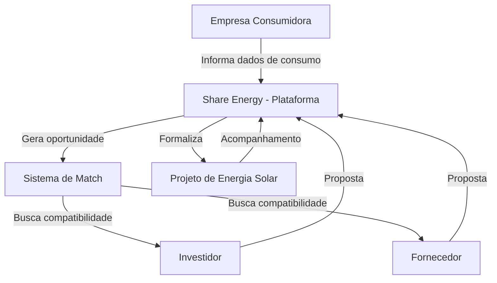

# Share Energy — Arquitetura

> Esta tarefa foi executada sem acesso ao código-fonte do projeto Share Energy — não havia repositório disponível para análise no ambiente em que este documento foi gerado. Por essa razão, nenhum componente técnico abaixo pôde ser confirmado como existente. Este documento descreve exclusivamente a **arquitetura conceitual/pretendida**, com base no material descritivo fornecido sobre o projeto.
>
> **Não identificado na implementação atual.**

---

## 1. Frontend

Não identificado na implementação atual — nenhum framework, biblioteca ou estrutura de frontend foi confirmado em código.

**Status: A definir**

---

## 2. Backend

Não identificado na implementação atual — nenhuma linguagem, framework ou estrutura de backend foi confirmado em código.

**Status: A definir**

---

## 3. Banco de Dados

Não identificado na implementação atual — nenhum sistema de banco de dados foi confirmado em código.

**Status: A definir**

---

## 4. APIs

Não identificado na implementação atual — nenhum endpoint, contrato de API ou protocolo de comunicação foi confirmado em código.

**Status: A definir**

---

## 5. Autenticação

Não identificado na implementação atual — nenhum mecanismo de autenticação foi confirmado em código.

**Status: A definir**

---

## 6. Comunicação entre Componentes

Não identificado na implementação atual.

**Status: A definir**

---

## 7. Módulos, Rotas, Serviços e Modelos

Não identificado na implementação atual — não há estrutura de código disponível para mapear módulos, rotas, serviços ou modelos de dados.

**Status: A definir**

---

## 8. Integrações

Não identificado na implementação atual — nenhuma integração externa (ex.: distribuidoras de energia, gateways de pagamento, serviços de terceiros) foi confirmada em código.

**Status: A definir**

---

## 9. Infraestrutura

Não identificado na implementação atual — nenhum ambiente de hospedagem, deploy ou containerização foi confirmado em código.

**Status: A definir**

---

## 10. Armazenamento

Não identificado na implementação atual.

**Status: A definir**

---

## 11. Segurança

Não identificado na implementação atual — nenhuma prática de segurança (criptografia, controle de acesso, etc.) foi confirmada em código.

**Status: A definir**

---

## 12. Fluxo de Dados (Conceitual)

O diagrama abaixo representa apenas o **fluxo de dados pretendido** entre os participantes da plataforma, conforme descrito no material conceitual do projeto — e não uma arquitetura técnica implementada.

**Status: Planejado** — este fluxo não representa componentes técnicos reais (frontend, backend, banco de dados), apenas a relação conceitual entre os participantes do negócio.

---

## 13. Resumo de Status

| Componente | Status |
|---|---|
| Frontend | Não identificado na implementação atual |
| Backend | Não identificado na implementação atual |
| Banco de dados | Não identificado na implementação atual |
| APIs | Não identificado na implementação atual |
| Autenticação | Não identificado na implementação atual |
| Infraestrutura | Não identificado na implementação atual |
| Fluxo de dados (conceitual) | Planejado |

---

## 14. Próximos Passos Recomendados

Para que este documento possa ser complementado com informações técnicas reais, é necessário disponibilizar o repositório/código-fonte do projeto Share Energy para análise, incluindo, quando existirem, as pastas `backend/`, `frontend/` e `database/`.
